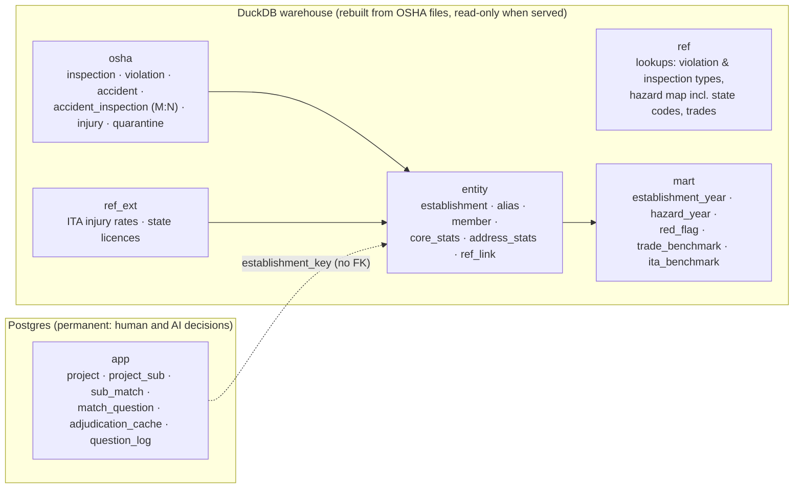

# Site Safety Intelligence

**Which subs' OSHA histories should worry a general contractor, with the inspections behind every flag.**

A GC bidding a job pastes in its 10–15 subcontractors and gets a ranked scorecard. Each sub gets a verdict built from fixed rules over OSHA enforcement records, with links to the source inspections. The foreman can ask plain-English questions about those subs from a phone on site.

- **The GC's view.** Each sub gets one of five verdicts: High concern, Review, No OSHA record, No recent record, or No flags. Each verdict comes with the reasons and the inspection IDs behind them.
  - Matching is automatic. The GC is only asked yes/no when an uncertain record carries a red flag.
  - "No OSHA record" is shown as *unknown*, never as clean.
- **The foreman's view.** A phone chat that answers only from a fixed set of named queries.
  - Every figure is checked against the query results, and every event links to osha.gov.
  - If "the mechanical sub" could mean two subs, it asks which one.
- **Data:** the last 10 years of OSHA construction enforcement: 322,607 inspections and 584,919 citations, Sept 2016 to Sept 2026. The history length is a setting, `SSI_HISTORY_YEARS`; `0` keeps all 2.5M inspections back to 1972, which the pipeline also builds and tests. It's enriched with OSHA's injury-rate filings (ITA 300A) and WA, OR and CA contractor licences.

> Demo project: *Hospital expansion, Nashville TN*, 13 real Southeast subs (`make seed-demo`). All facts come from public OSHA records; verdicts are mechanical summaries of those records, not judgements about any company.

Supporting docs:
- [docs/thought-process.md](docs/thought-process.md): the full decision log
- [docs/data-profile.md](docs/data-profile.md): how messy the data is, with numbers
- [docs/domain-cheat-sheet.md](docs/domain-cheat-sheet.md): construction safety terms

---

## Contents
1. [The database schema, and why it's structured this way](#1-the-database-schema-and-why-its-structured-this-way)
2. [The data and its traps](#2-the-data-and-its-traps)
3. [Matching subs to OSHA records](#3-matching-subs-to-osha-records)
4. [Verdicts: flags with evidence, not a score](#4-verdicts-flags-with-evidence-not-a-score)
5. [The foreman's questions](#5-the-foremans-questions)
6. [Other public data](#6-other-public-data)
7. [Architecture](#7-architecture)
8. [Evaluation](#8-evaluation)
9. [Running it](#9-running-it)
10. [Assumptions, limitations, next steps](#10-assumptions-limitations-next-steps)

---

## 1. The database schema, and why it's structured this way

**The core problem.** OSHA records have **no company identifier**. The employer name is typed per inspection:
- One company shows up under dozens of spellings. Brasfield & Gorrie, a GC, appears as `BRASFIELD & GORRIE, LLC`, `136200 - BRASFIELD - GORRIE, L.L.C.`, `BRASFIELD & GORIE GP` and more.
- Unrelated companies share common names.

The schema is built around that fact.

### Six layers, two stores



| Layer | What it holds | Rebuilt from source? |
|---|---|---|
| `ref` | Hand-maintained lookups in versioned CSVs: violation types, inspection types (all 14 codes confirmed against DOL's metadata), 20 hazard categories, and a ~540-rule standard-code → hazard map covering **state-plan codes too** (99.6% of construction citations since 2015 map to a real category; [docs/hazard-map.md](docs/hazard-map.md)) | From the repo |
| `osha` | OSHA's records, cleaned and typed, never judged. Bad values are flagged (`dq_flags`), never deleted. Rows that fail integrity checks go to `quarantine` with a reason | Yes |
| `entity` | Inspections grouped into **establishments**: identical cleaned name + address key + zip + state. Plus name variants, distinctiveness stats, shared-office stats, and links to reference data | Yes |
| `ref_ext` | Outside data: ITA 300A injury summaries and WA/OR/CA contractor licences | Yes |
| `mart` | Precomputed figures, additive at establishment-year grain, plus an event-level red-flag table with lineage back to the inspection | Yes |
| `app` | The GC's projects, subs and every match decision (bucket, method, rule, confidence, rationale, who decided), plus question logs | **No: it's the only layer that can't be regenerated** |

### Why this shape

| Decision | Why | What it costs |
|---|---|---|
| **No global "company" table.** A company is the set of establishments matched to *one GC's sub* (`app.sub_match`). | Grouping 1.2M name variants into companies blind gives wrong merges; in a spot check, 1 in 6 fuzzy merges was wrong. A wrong merge can pin someone else's fatality on a sub. The company question is decided per sub, where the GC's evidence is. | Matching runs when a sub is added, not once globally. AI decisions are cached by an evidence hash, so the same pair isn't re-decided. |
| **Establishments only merge on exact cleaned values.** | Safe by construction. A wrong *split* costs a little review; a wrong *merge* is silent and harmful. | One company becomes many establishments (Brasfield & Gorrie is 129). The matcher puts them back together, with rules and evidence. |
| **Layers split by trust and rebuildability; decisions in a separate store.** | A pipeline rebuild can never destroy a GC's confirmed matches. Every figure traces to source records. | `app` can't use foreign keys into the rebuildable warehouse. Instead, establishment keys are **deterministic hashes** (the same input gives the same key every build), and `entity.establishment_member` lets a rule change remap old keys to new ones by inspection overlap. |
| **Facts in DuckDB, decisions in Postgres.** | Each store fits its workload: scanning millions of rows for analysis vs small, concurrent transactional writes. Full history stays online at no hosting cost. | Two stores, joined in API code. That's cheap: a sub's scope is tens of keys. DuckDB has no trigram index, so candidate search uses a token-blocking table plus Jaro-Winkler. |
| **Normalised facts; accidents ↔ inspections many-to-many.** | OSHA opens an inspection for *every* employer on a fatality site and copies the injury rows to each. Storing the accident once and linking it to each inspection avoids duplication and false attribution. | More joins; fine at this size. |
| **Fatality is a status per inspection, not a boolean:** `fatality_cited` / `fatality_inspected_not_cited` / `fatcat_cited` / `accident_outcome_unknown`. | Being on a site where someone died isn't the same as causing it. Only *cited* fatalities drive a High verdict. | Extra logic in the pipeline. |
| **Rollups are additive at establishment × year.** | The lookback window (3/5/10 years) is a setting, not a schema decision. A sub's figures are sums over its matched keys and years. The red-flag table covers the whole history window, so catastrophic events count however old they are within it. | Duplicated data. Company-level medians can't be precomputed, but benchmarks describe *peers*, so that's fine. |
| **Flag, don't delete.** Blank penalty ≠ $0; deleted citations are marked, not removed; an `other` hazard bucket. | Totals always reconcile: hazard counts sum to citation counts, a build check. Every quirk stays visible. | Every query has to respect the flags, so only the named queries touch the data. |
| **One meaning per business term, in `ref`.** | "Fall protection" means 1926.501–503 *and* Washington's `296-155-24510`, Oregon's `437-003-…` and so on, in both the GC view and the foreman's answers. | The map needs upkeep. Unmapped codes land in `other` and are still counted. |
| **New file per build, then an atomic pointer swap.** | A failed build never replaces live data. The previous build stays available for rollback. | 2× disk during a build. Daily incremental updates via the DOL API are a next step. |

**Key tables:**
- `osha.inspection`: PK `activity_nr`. Columns include `establishment_key`, `jurisdiction`, `scope_reason`, `fatality_status`, `is_open`, `site_group_n` (employers on the same site and day) and `dq_flags`.
- `osha.violation`: PK `(activity_nr, citation_id)`. Columns include `standard_cite` (`1926.501(b)(13)`), `hazard_code` (never NULL), nullable penalties, `is_deleted` and `is_fta`.
- `entity.establishment`: PK `establishment_key = md5(clean_name|addr_key|zip5|state)`.
- `mart.red_flag`: one row per fatality, willful, repeat or failure-to-abate event.
- `app.sub_match`: PK `(sub_id, establishment_key)`, with `bucket`, `method` (rule/llm/gc), `rule_id`, `confidence`, `rationale` and `evidence` (jsonb).

**Where the DDL lives:**
- `app` (Postgres): [ssi/store/app_schema.sql](ssi/store/app_schema.sql)
- Warehouse layers: the pipeline SQL in [ssi/pipeline/sql/](ssi/pipeline/sql/)

---

## 2. The data and its traps

I profiled every row before designing anything; the full profile is in [docs/data-profile.md](docs/data-profile.md). The traps that shaped the design:

| Trap | Evidence | Handling |
|---|---|---|
| No company ID | 266k distinct names across 377k construction inspections since 2015 | Establishments + matching (§3) |
| Per-inspection IDs inside names | 17.6% of names, e.g. `WA317965935 - BARNHART CRANE`; mostly WA, NC and OR | Stripped by a cleaning rule; measured per rule each build |
| Industry codes drift | 44% of firms with 5+ inspections carry several NAICS codes; SIC→NAICS changed in the 2000s | Scope = every inspection of any establishment with ≥1 construction-coded inspection (+175k inspections recovered) |
| Accident detail is stale | Accident records end 2025-03-28. Coverage of accident-type inspections falls from 85% (2017–19) to 0% (2026) | Fatality status from the inspection type when there's no detail; the coverage note says so |
| Shared-site duplication | 32% of construction inspections share a site and date with another employer | `accident_inspection` M:N; "cited vs not cited" |
| Recent data is provisional | 65% of 2026 and 49% of 2025 citations are from open cases; settlements cut penalties 18–36% | Open cases flagged "provisional"; initial *and* current penalty shown |
| State plans use their own codes | 23% of construction citations (WA `296-155`, OR `OAR 437`, MI, CA Title 8) | Hazard map covers them |
| A 2026 load batch shifted a column | Construction operation landed in `const_op_cause` (394/394 cross-checks) | Fixed in the pipeline |
| Blank ≠ zero | Penalties blank 37–71% of the time before 2010; $0 after | Nullable penalties; old history judged by citation *type*, not dollars |
| Fields that look useful but aren't | `why_no_insp` is filled on ~100% of rows; `state_flag` is always empty; `nr_in_estab` goes up to 1,000,000; `fta_penalty` is mostly `0.00` | Kept raw, with no logic built on them |

**How far back.** The warehouse keeps the last **10 years** by default (`SSI_HISTORY_YEARS`). Within that, two tiers:
- **The project window** (3, 5 or 10 years) for rates, trends and penalties.
- **The whole history window** for catastrophic or repeated offences: cited fatalities, willful violations, failure-to-abate and repeat-violation patterns.

Setting `SSI_HISTORY_YEARS=0` turns the second tier into a truly unlimited lookback back to 1972, and the verdicts then also flag catastrophic events older than 10 years. Ten years is the default because it keeps the data small (a 192 MB warehouse) while covering what GCs typically ask about. Older records are also harder to attribute confidently to today's company.

---

## 3. Matching subs to OSHA records

```
GC enters: name, city, state (+ optional trade, licence #)
  1. Clean the name with the SAME rules that built the data (DuckDB macros stored in the warehouse)
  2. Candidates: exact alias · same name core · rarest name words (typo-tolerant) · records at matched addresses
  3. Ordered rules → MATCHED / UNCERTAIN / EXCLUDED, each with rule_id + reason
  4. UNCERTAIN only → AI adjudicator (identity evidence only, validated in code)
  5. Any uncertain record carrying a red flag → a yes/no question to the GC (max 3 per sub)
```

**Cleaning** ([ssi/cleaning/macros.sql](ssi/cleaning/macros.sql)). It only removes noise that never distinguishes companies: case, punctuation, legal forms at the end, ID prefixes, `&`/`AND`/`-`, and runs of initials. It keeps trade words, initials, numbers and place words. 42 trap tests cover the edge cases: `C AND A` ≠ `C AND S`, `BRASFIELD CONSTRUCTION` ≠ `BRASFIELD & GORRIE`, `84 LUMBER` unchanged. The cleanup cuts distinct names since 2015 from 265,936 to 195,124 (−27%).

**Rules** ([ssi/matching/rules.py](ssi/matching/rules.py)):

| Rule | When | Bucket |
|---|---|---|
| M1 | Same full name, same state, and the name is *distinctive* (or the same city) | Matched |
| M1b | Same distinctive core, differing only by descriptor words (GENERAL, CONTRACTORS…) | Matched |
| M2 | At an already-matched address, name differs only by spelling | Matched |
| M3 | Same distinctive name in another state ("also operates in …") | Matched |
| L1 | Linked to the licence number the GC entered | Matched |
| S1 | Differs only by `OF <STATE>` / `AT <project>`: usually a sibling company | Uncertain |
| U3 | Same family name, different *trade* word (WAUSAU HOMES vs WAUSAU TILE) | Uncertain |
| X1–X4 | Different real name word; different common name; common name in another state | Excluded |

**Name distinctiveness** is measured from the data, not hand-listed: how many distinct full names share the name's core.
- `BRASFIELD GORRIE` has 3, so it's distinctive.
- `CLARK` has 112 and `ABC` has 114, so they're generic.

Common names need a city match to auto-match. A GC's typo (`Brasfeild`) adopts OSHA's dominant spelling when that spelling has ≥5× the inspections, and the GC is told.

**What the GC sees:** *Matched* (counted) · *Possible* ("+N inspections if these are yours", not counted) · *Excluded lookalikes* (collapsed). The GC can move any record between buckets; that's stored as `method = 'gc'` and always wins.

---

## 4. Verdicts: flags with evidence, not a score

A GC has to be able to defend turning a sub down, so the tool gives **reasons with inspection IDs** rather than a single number ([ssi/scoring/verdict.py](ssi/scoring/verdict.py)). Recent = within 10 years; W = the project window.

| Verdict | Triggered by |
|---|---|
| **High concern** | Any of the following:<br>• a cited fatality, willful violation, failure-to-abate or fatality/catastrophe investigation with serious citations, recent<br>• repeat violations in ≥2 separate inspections within W<br>• serious citations per inspection in the trade's top 10% (≥5 inspections, ≥30 peers) |
| **Review** | Any of the following:<br>• the same events but older than 10 years<br>• one repeat within W<br>• a rate above most peers<br>• a hazard cited in ≥3 separate inspections with at least one inside the window (older patterns show as information)<br>• open cases with serious citations<br>• a pending match question<br>• self-reported lost-time rate (DART) above the trade's 75th percentile in 2 of the last 3 years<br>• a lapsed licence<br>• a recent fatality on site where the sub wasn't cited |
| **No OSHA record** | No matched records: **"unknown, not clean"**. Ask the sub for its EMR, TRIR and 300 logs |
| **No recent record** | Matched records exist, but none in W |
| **No flags** | Matched records in W and nothing above |

**Benchmarks** compare against peers in the same trade (NAICS 4 → 3 → all construction). They use the median and percentiles, never the mean, and need a minimum sample size. Follow-up, monitoring and variance visits are excluded from rate denominators.

---

## 5. The foreman's questions

**Named queries, not text-to-SQL.** The model never writes SQL. It picks from about 12 tested query tools ([ssi/agent/tools.py](ssi/agent/tools.py)) and fills in parameters:
- `compare_subs`, `sub_summary`, `red_flags`, `citations_by_hazard`, `fatality_history`, `injury_rates`, `trend_by_year`, `open_cases`, `inspection_list`, `inspection_detail`
- `lookup_company`, for firms not on the project; requires name, city and state
- `ask_which_sub` and `report_unanswerable`

The `sub_id` parameter is an **enum of this project's subs**, so the model can't query an unconfirmed company by accident. The same functions power the GC view, so a term means the same thing in both.

**Guards enforced in code, not in the prompt** ([ssi/agent/foreman.py](ssi/agent/foreman.py)):
1. **Precondition.** A sub with unanswered match questions returns `needs_confirmation` from every tool.
2. **Grounding.** Every number, date and inspection ID in the answer must appear in the tool results. Queries precompute every figure the model might quote, and the prompt says "quote, never compute". A failure gets one retry, then a deterministic fallback.
3. **Citations.** Inspection IDs become osha.gov links.
4. **Coverage.** The "based on N inspections, data as of…, accident detail through…" note is appended by code, never written by the model.

**Models.** Each role has its own model, chosen in `.env`:
- **Foreman:** GLM 5.3. It's a multi-step conversation with tool calls.
- **Adjudicator:** DeepSeek V4.1 Flash. It makes many short same/different/unsure calls.

Both are served from Modal as OpenAI-compatible APIs.

**With Claude instead,** it's `claude-sonnet-5-5` through the Anthropic SDK:
- low effort
- strict tools with `tool_choice: auto` (Sonnet 5.5 rejects forced tool choice)
- structured outputs for the adjudicator
- server-side refusal fallbacks enabled (`fallbacks: "default"`)
- prompt caching on tools and the system prompt

`SSI_LLM_PROVIDER=openai_compat` switches to any OpenAI-compatible endpoint, such as a self-hosted model on Modal. Without a key, the app runs **rules-only**: uncertain records stay "possible", and the chat says it needs a key. Every LLM call is traced in LangSmith when a key is set.

**The AI adjudicator** ([ssi/llm/adjudicator.py](ssi/llm/adjudicator.py)):
- **What it sees:** identity evidence only (names, addresses, years, trade codes, the GC's input). **Never safety history**, so a fatality can't bias whether a record is judged "the same company".
- **Validation in code:** it must cite evidence IDs that exist, and any number or place it mentions must appear in the evidence. Otherwise the answer is discarded.
- **Mapping:** "same" at ≥0.85 confidence → matched; "different" at ≥0.80 → excluded; otherwise possible.

---

## 6. Other public data

I evaluated four sources ([details](docs/thought-process.md)):

| Source | What it adds | How it's used |
|---|---|---|
| **OSHA ITA 300A** (2016–2025, 3.2M filings) | Hours worked and injury counts, giving **TRIR / DART**. EIN from 2019 | Linked by exact name + zip/address; links ~95% precise, covering about 20% of recent inspections. Shown against the **pooled industry rate** for the trade (all filers' cases ÷ hours, the way BLS reports it), because most small filers report zero, which makes medians meaningless. The EIN is evidence for the adjudicator, **never an automatic merge**: big firms file under many EINs (one has 23) and some EINs are junk. |
| **WA L&I licences** (161k, incl. expired) | Legal name, UBI, status | A GC can enter a licence number to pin a sub (rule L1); licence status is shown |
| **OR CCB** (active licences only) | Same | Same |
| **CA CSLB** | Same, plus DBA names | Partial: the server cuts the download at ~15 MB, so a full file needs a browser download |
| SAM.gov, OpenCorporates | Not used | Need an account or a paid key |

The surprise: **none of these merges OSHA records much.** Grouping by cleaned name within a state already merges more than any outside ID. Their value is verified identity and injury rates, not merging.

---

## 7. Architecture

```
DOL / OSHA / WA / OR ──► build (DuckDB, ~1–2 min; nightly on Modal) ──► warehouse-<id>.duckdb ─┐ CURRENT pointer
                                                                                                ▼
            React SPA (web/) ◄── FastAPI (ssi/api) ──► DuckDB (read-only facts) + Postgres (decisions)
                                     └──► Claude (adjudicator, foreman) · LangSmith traces
```

- **Pipeline** ([ssi/pipeline/](ssi/pipeline/)): ordered SQL files; about a minute end to end, a 192 MB warehouse with the 10-year default. Intermediate tables go in a scratch DB; only final layers go in the warehouse. 9 data-quality checks run each build, and error-level failures stop the pointer swap. The build report records per-rule merge counts and timings.
- **API** ([ssi/api/app.py](ssi/api/app.py)): FastAPI with a typed contract ([ssi/api/schemas.py](ssi/api/schemas.py)) mirrored in `web/src/api/types.ts`. Basic auth when configured.
- **Web** ([web/](web/)): Vite + React + Tailwind. Mobile-first: the foreman's view is designed for 375 px.
- **Deploy** ([modal_app.py](modal_app.py)): a nightly `refresh` downloads and builds on a Modal Volume; `web` serves the app and copies the warehouse to local disk on cold start. Postgres for `app` is any Postgres (Supabase free tier is plenty: the app layer is tiny).

**Why these tools:**
- **DuckDB** builds 18M raw rows in about a minute on a laptop, reads the CSVs directly, and serves read-only analytical queries in-process. Polars would also have worked; I wanted one language, SQL, across pipeline and queries.
- **Postgres** holds the small, concurrently written decisions.
- **Rejected:** Spark/BigQuery as overkill; MongoDB, because the data is relational; Neo4j as future work, for "which subs keep turning up on the same sites".

---

## 8. Evaluation

**Tests:** `uv run pytest`, 70 tests:
- the cleaning traps
- every matching rule
- verdict thresholds
- the adjudicator validator
- the grounding checker
- a fake-model end-to-end foreman loop

The web front end has 18 more (`npm test`).

**Matching**, on a silver-labelled set ([eval/matching/](eval/matching/)):
- **Positives:** OSHA records that link to the same tax ID in the injury filings.
- **Negatives:** same name core and state, different tax IDs.

300 pairs, repeatable sample, run on the default 10-year data. Full table in [eval/matching/results.md](eval/matching/results.md):

| Metric | 10-year data | All years | Meaning |
|---|---|---|---|
| Precision of automatic matches | **0.83** | 0.90 | Of records auto-matched, the share with the same tax ID |
| Candidate recall | 0.96 | 0.95 | The right record was found at all |
| False exclusions | 0.00 | 0.013 | Same-company records wrongly excluded |
| Different companies kept out | 0.86 | 0.93 | Not auto-matched |
| Same-company records left "possible" | 0.27 | 0.33 | Sent to the AI adjudicator or the GC, not counted |

**Reading the precision honestly.** I reviewed the disagreements by hand. The auto-matches the labels call "different" are corporate families filing under several tax IDs, not different businesses that happen to share a name:
- D.R. Horton's regional divisions in NC, TX and CA
- Hensel Phelps in Honolulu and Kaneohe
- `HAGERMAN` vs `HAGERMAN CONSTRUCTION`
- `LOBAR` vs `LOBAR ASSOCIATES`
- `BL SHEET METAL ROOFING` twice in Bloomington

A GC would most likely treat each as one company. Precision is lower on 10-year data because, with less history, fewer spelling variants exist per name, so more names count as "distinctive" and auto-match across offices. The labels are "silver" for exactly this reason.

**What the first run taught.** Auto-matching names that differed only by *trade* words (`WAUSAU HOMES` vs `WAUSAU TILE`, `TURNKEY CONSTRUCTION` vs `TURNKEY ELECTRIC`) was the real error. Splitting generic words into *descriptors* (GENERAL, CONTRACTORS, SERVICES) and *trade words* removed it. On all-years data, precision rose from 0.87 to 0.90.

**Foreman.** 20 questions with expected tools, statuses and phrases ([eval/foreman/](eval/foreman/)). It spends API credit, so it runs deliberately: `uv run python -m eval.foreman.run`. Results are logged to LangSmith.

---

## 9. Running it

**Prerequisites:** [uv](https://docs.astral.sh/uv/), Postgres 17 (`brew install postgresql@17`), Node 20+.

```bash
make setup          # Python env, local databases ssi/ssi_test, web deps
make download       # OSHA enforcement zips (~3.6 GB) + WA/OR licence lists
make build          # warehouse in ~1-2 minutes
make seed-demo      # demo project through the real API code
cd web && npm run build && cd .. && make api   # http://localhost:8000
```

**Optional manual downloads:**
- OSHA ITA files from <https://www.osha.gov/Establishment-Specific-Injury-and-Illness-Data>, saved to `data/raw/reference/osha_ita/utf8/`
- CSLB "License Master" CSV from <https://www.cslb.ca.gov/onlineservices/dataportal/ContractorList>, saved to `data/raw/reference/ca_cslb/cslb_master.csv`

Without them, enrichment is just empty.

**Configuration** is in `.env` (see [.env.example](.env.example)):
- `DATABASE_URL`: the local Postgres for the app layer (default `postgresql://localhost:5432/ssi`).
- `SSI_HISTORY_YEARS`: years of OSHA history to keep (default 10; `0` = all years).
- **AI model** (optional; without one the app runs rules-only):
  - **Claude:** `ANTHROPIC_API_KEY`.
  - **OpenAI-compatible endpoints, one per role.** This repo runs both on Modal: **GLM 5.3** for the foreman's Q&A (multi-step, tool calls) and **DeepSeek V4.1 Flash** for the match adjudicator (many short judgements).
    - Provider: `SSI_LLM_PROVIDER=openai_compat`
    - Foreman: `SSI_LLM_FOREMAN_BASE_URL` (+ optional `SSI_LLM_FOREMAN_MODEL`)
    - Adjudicator: `SSI_LLM_ADJUDICATOR_BASE_URL` (+ optional `SSI_LLM_ADJUDICATOR_MODEL`)
    - Modal proxy auth, shared by both: `SSI_LLM_MODAL_KEY` / `SSI_LLM_MODAL_SECRET`

  Check both endpoints with `uv run python -m scripts.check_llm`: one plain call, one JSON call and one tool call per role.
- `LANGSMITH_API_KEY` (optional): traces and eval experiments.

**Hosting.** It runs locally today. [docs/deploy.md](docs/deploy.md) describes the optional hosted setup: the React site on Vercel, and the API plus nightly data refresh as a Modal app ([modal_app.py](modal_app.py)).

---

## 10. Assumptions, limitations, next steps

**Assumptions**
- **Matching is automatic;** the GC only confirms uncertain matches that carry red flags. The point is a *quick* view, and a wrong red flag is the costly error.
- **No record is not a clean record.** OSHA inspects a small share of employers.
- **One decode is evidence-based, not officially documented:** `reporting_id`'s third digit `5` marking state-plan offices. It holds for 99.98% of inspections citing state-specific codes, and all 188 such office IDs on OSHA's office list are state plans. The inspection-type codes (`A` accident, `M` fatality/catastrophe and the rest) are confirmed against DOL's own dataset metadata.

**Limitations**
- **Unidentified employers.** Placeholder employers (`UNKNOWN ROOFER`, ~1,800 inspections) may be real subs, but can't be matched.
- **Name changes.** Renamed or sold companies aren't linked unless a licence or EIN connects them. Same name and address with a new owner is indistinguishable.
- **Injury data coverage.** ITA covers firms with 20+ employees, and most small subs won't have a rate.
- **California licences.** The CSLB file is partial.
- **Benchmarks.** They compare a sub (possibly multi-establishment) with single establishments; per-inspection rates make that tolerable.

**Next steps**
- Daily incremental updates through the DOL API (`load_dt`, `case_mod_date`) instead of full rebuilds.
- A human-labelled gold set for matching, using the LangSmith annotation queue.
- OSHA's Severe Violator Enforcement Program list and severe injury reports as more red flags.
- A graph view of which subs keep appearing on the same sites (`site_group_id` already captures it).

**Credits**
- **Design ideas:** AI One's public paper *ContextOne: A Context and Control Architecture for Enterprise AI* (2026). The entity-matching pipeline, adapted: rules before the LLM, no embedding stage, adjudication only on demand. Also Named Queries, one meaning per business term, precondition and grounding checks, and lineage.
- **Data:** U.S. DOL / OSHA, WA L&I, Oregon CCB, California CSLB.

## Repo map

```
ssi/cleaning/      name & address rules (DuckDB macros) — one implementation for build and query time
ssi/pipeline/      download.py, build.py, sql/ (ordered steps), ref/ (lookup CSVs)
ssi/matching/      candidate search, ordered rules, adjudication flow
ssi/queries/       named queries shared by the GC view and the foreman
ssi/scoring/       verdict rules
ssi/agent/         foreman tools, grounding, loop
ssi/llm/           provider switch (Anthropic / OpenAI-compatible), adjudicator
ssi/api/           FastAPI app + API contract
ssi/store/         DuckDB reader, Postgres pool, app schema
web/               React SPA
eval/              matching (silver labels) and foreman evaluations
scripts/           demo seed
docs/              decision log, data profile, glossary
modal_app.py       nightly build + web deployment
```
