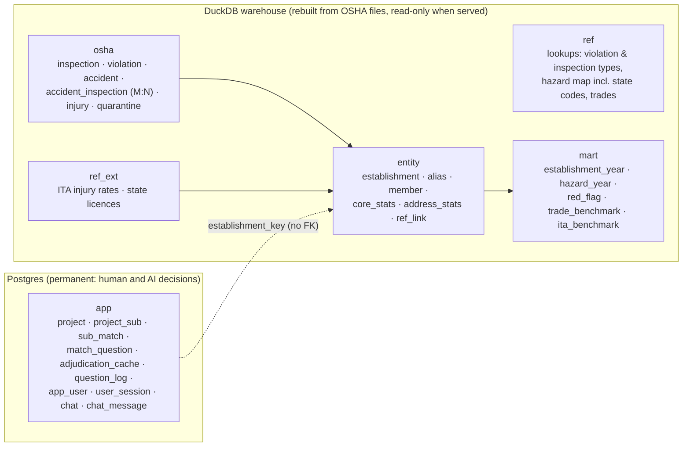

# Site Safety Intelligence

**Which subs' OSHA histories should worry a general contractor, with the inspections behind every flag.**

A GC bidding a job enters its 10–15 subcontractors (one row of fields each, or pasted from a spreadsheet to fill the rows) and gets a ranked scorecard. Each sub gets a verdict built from fixed rules over OSHA enforcement records, with links to the source inspections. The foreman can ask plain-English questions about those subs from a phone on site.

- **The GC's view.** Each sub gets one of five verdicts: High concern, Review, No OSHA record, No recent record, or No flags. Each verdict comes with the reasons and the inspection IDs behind them.
  - Matching is automatic. The GC is only asked yes/no when an uncertain record carries a red flag.
  - "No OSHA record" is shown as *unknown*, never as clean.
- **The foreman's view.** A phone chat that answers only from a fixed set of named queries.
  - Every figure is checked against the query results, and every cited inspection opens its record (citations, penalties, accident narrative), with a link to find it on osha.gov.
  - If "the mechanical sub" could mean two subs, it asks which one.
  - Each person signs in (accounts are invite-only), and their conversations are saved, private to them, to reopen later.
- **Data:** the last 10 years of OSHA construction enforcement: 319,689 inspections (plus 18,550 files where OSHA didn't inspect) and 585,758 citations, Sept 2016 to Sept 2026. The history length is a setting, `SSI_HISTORY_YEARS`; `0` keeps all 2.5M inspections back to 1972, which the pipeline also builds and tests. It's enriched with OSHA's injury-rate filings (ITA 300A) and WA, OR and CA contractor licences.

> Demo project: *Hospital expansion, Nashville TN*, 13 real Southeast subs (`make seed-demo`). All facts come from public OSHA records; verdicts are mechanical summaries of those records, not judgements about any company.

Supporting docs:
- [docs/thought-process.md](docs/thought-process.md): the full decision log
- [docs/data-profile.md](docs/data-profile.md): how messy the data is, with numbers
- [docs/data-flow.html](docs/data-flow.html): a diagram of every step from raw OSHA files to a sub's verdict, with the problem each step fixes (open it in a browser)
- [docs/domain-cheat-sheet.md](docs/domain-cheat-sheet.md): construction safety terms

---

## Contents
1. [The database schema, and why it's structured this way](#1-the-database-schema-and-why-its-structured-this-way)
2. [The data and its traps](#2-the-data-and-its-traps)
3. [Matching subs to OSHA records](#3-matching-subs-to-osha-records)
4. [Verdicts: flags with evidence, not a score](#4-verdicts-flags-with-evidence-not-a-score)
5. [The foreman's questions](#5-the-foremans-questions)
6. [Other public data](#6-other-public-data)
7. [Architecture](#7-architecture)
8. [Evaluation](#8-evaluation)
9. [Running it](#9-running-it)
10. [Assumptions, limitations, next steps](#10-assumptions-limitations-next-steps)

---

## 1. The database schema, and why it's structured this way

**The core problem.** OSHA records have **no company identifier**. The employer name is typed per inspection:
- One company shows up under dozens of spellings. Brasfield & Gorrie, a GC, appears as `BRASFIELD & GORRIE, LLC`, `136200 - BRASFIELD - GORRIE, L.L.C.`, `BRASFIELD & GORIE GP` and more.
- Unrelated companies share common names.

The schema is built around that fact.

### Six layers, two stores



| Layer | What it holds | Rebuilt from source? |
|---|---|---|
| `ref` | Hand-maintained lookups in versioned CSVs: violation types, inspection types (all 14 codes confirmed against DOL's metadata), 20 hazard categories, and a ~540-rule standard-code → hazard map covering **state-plan codes too** (99.6% of construction citations since 2015 map to a real category; [docs/hazard-map.md](docs/hazard-map.md)) | From the repo |
| `osha` | OSHA's records, cleaned and typed, never judged. Bad values are flagged (`dq_flags`), never deleted. Rows that fail integrity checks go to `quarantine` with a reason | Yes |
| `entity` | Inspections grouped into **establishments**: identical cleaned name + address key + zip + state. Plus name variants, distinctiveness stats, shared-office stats, and links to reference data | Yes |
| `ref_ext` | Outside data: ITA 300A injury summaries and WA/OR/CA contractor licences | Yes |
| `mart` | Precomputed figures, additive at establishment-year grain, plus an event-level red-flag table with lineage back to the inspection | Yes |
| `app` | The GC's projects, subs and every match decision (bucket, method, rule, confidence, rationale, who decided), question logs, and the people who sign in with their saved chats | **No: it's the only layer that can't be regenerated** |

### Why this shape

| Decision | Why | What it costs |
|---|---|---|
| **No global "company" table.** A company is the set of establishments matched to *one GC's sub* (`app.sub_match`). | Grouping 1.2M name variants into companies blind gives wrong merges; in a spot check, 1 in 6 fuzzy merges was wrong. A wrong merge can pin someone else's fatality on a sub. The company question is decided per sub, where the GC's evidence is. | Matching runs when a sub is added, not once globally. AI decisions are cached by an evidence hash, so the same pair isn't re-decided. |
| **Establishments only merge on exact cleaned values.** | Safe by construction. A wrong *split* costs a little review; a wrong *merge* is silent and harmful. | One company becomes many establishments (Brasfield & Gorrie is 129). The matcher puts them back together, with rules and evidence. |
| **Layers split by trust and rebuildability; decisions in a separate store.** | A pipeline rebuild can never destroy a GC's confirmed matches. Every figure traces to source records. | `app` can't use foreign keys into the rebuildable warehouse. Instead, establishment keys are **deterministic hashes** (the same input gives the same key every build), and `entity.establishment_member` lets a rule change remap old keys to new ones by inspection overlap. |
| **Facts in DuckDB, decisions in Postgres.** | Each store fits its workload: scanning millions of rows for analysis vs small, concurrent transactional writes. Full history stays online at no hosting cost. | Two stores, joined in API code. That's cheap: a sub's scope is tens of keys. DuckDB has no trigram index, so candidate search uses a token-blocking table plus Jaro-Winkler. |
| **Normalised facts; accidents ↔ inspections many-to-many.** | OSHA opens an inspection for *every* employer on a fatality site and copies the injury rows to each. Storing the accident once and linking it to each inspection avoids duplication and false attribution. | More joins; fine at this size. |
| **Fatality is a status per inspection, not a boolean:** `fatality_cited` / `fatality_inspected_not_cited` / `fatality_pending` / `fatcat_cited` / `fatcat_not_cited` / `fatcat_no_inspection` / `accident_outcome_unknown`. | Being on a site where someone died isn't the same as causing it. Only *cited* fatalities drive a High verdict. OSHA's accident detail lags (it ends 2025-03-28 in this load), so an investigation without published detail is still flagged: *pending* while citations can still come (OSHA must cite within 6 months), *cited* / *not cited* after that, *no inspection* when OSHA opened the file but didn't inspect this employer. | Extra logic in the pipeline. A build check fails if any fatality/catastrophe investigation without detail has no flag. |
| **Rollups are additive at establishment × year.** | The lookback window (3/5/10 years) is a setting, not a schema decision. A sub's figures are sums over its matched keys and years. The red-flag table covers the whole history window, so catastrophic events count however old they are within it. | Duplicated data. Company-level medians can't be precomputed, but benchmarks describe *peers*, so that's fine. |
| **Flag, don't delete.** Blank penalty ≠ $0; deleted citations are marked, not removed; an `other` hazard bucket. | Totals always reconcile: hazard counts sum to citation counts, a build check. Every quirk stays visible. | Every query has to respect the flags, so only the named queries touch the data. |
| **One meaning per business term, in `ref`.** | "Fall protection" means 1926.501–503 *and* Washington's `296-155-24510`, Oregon's `437-003-…` and so on, in both the GC view and the foreman's answers. | The map needs upkeep. Unmapped codes land in `other` and are still counted. |
| **New file per build, then an atomic pointer swap.** | A failed build never replaces live data. The previous build stays available for rollback. | 2× disk during a build. Daily incremental updates via the DOL API are a next step. |

**Key tables:**
- `osha.inspection`: PK `activity_nr`. Columns include `establishment_key`, `jurisdiction`, `scope_reason`, `fatality_status`, `is_open`, `site_group_n` (employers on the same site and day) and `dq_flags`.
- `osha.violation`: PK `(activity_nr, citation_id)`. Columns include `standard_cite` (`1926.501(b)(13)`), `hazard_code` (never NULL), nullable penalties, `is_deleted` and `is_fta`.
- `entity.establishment`: PK `establishment_key = md5(clean_name|addr_key|zip5|state)`.
- `mart.red_flag`: one row per fatality, willful, repeat or failure-to-abate event.
- `app.sub_match`: PK `(sub_id, establishment_key)`, with `bucket`, `method` (rule/llm/gc), `rule_id`, `confidence`, `rationale` and `evidence` (jsonb).

**Where the DDL lives:**
- `app` (Postgres): [ssi/store/app_schema.sql](ssi/store/app_schema.sql)
- Warehouse layers: the pipeline SQL in [ssi/pipeline/sql/](ssi/pipeline/sql/)

---

## 2. The data and its traps

I profiled every row before designing anything; the full profile is in [docs/data-profile.md](docs/data-profile.md). The traps that shaped the design:

| Trap | Evidence | Handling |
|---|---|---|
| No company ID | 266k distinct names across 377k construction inspections since 2015 | Establishments + matching (§3) |
| Per-inspection IDs inside names | 17.6% of names, e.g. `WA317965935 - BARNHART CRANE`; mostly WA, NC and OR. Arizona (since 2021) and Iowa (since 2026) prefix a case number with letters: `FCX2024XEG419X0079 - VALLEYCARE LANDSCAPING` | Stripped by a cleaning rule; measured per rule each build. A build check fails if a case number is left in a name: each became a one-inspection company no search found, including 50 Arizona fatality/catastrophe investigations |
| Industry codes drift | 44% of firms with 5+ inspections carry several NAICS codes; SIC→NAICS changed in the 2000s | Scope = every inspection of any establishment with ≥1 construction-coded inspection **in any year** (+175k inspections recovered) |
| A construction company's plant, yard or shop is coded under another industry | Tindall's Conley GA precast plant (concrete manufacturing) had an open fatality/catastrophe investigation from Aug 2026 that no construction scope could see | **Related facilities**: records sharing a company name that is distinctive across *all* industries (≤5 variants, long enough, not a person's name), of a company with ≥20% of its inspections coded as construction, come in as `related_name` (10,713 inspections). They are shown as "facility not coded as construction" and only count once confirmed. Without the 20% rule, US Postal, Amazon and Dollar Tree came in too (28,726) |
| Accident detail is stale | Accident records end 2025-03-28. Coverage of accident-type inspections falls from 85% (2017–19) to 0% (2026) | Fatality status from the inspection type when there's no detail; the coverage note says so |
| Shared-site duplication | 32% of construction inspections share a site and date with another employer | `accident_inspection` M:N; "cited vs not cited" |
| Recent data is provisional | 65% of 2026 and 49% of 2025 citations are from open cases; settlements cut penalties 18–36% | Cases whose citations aren't final orders yet are "provisional"; initial *and* current penalty shown |
| An open case isn't a provisional one | OSHA keeps a case open until penalties are paid: 26,055 of 29,564 open cases with serious citations have every citation final (Reyes & Son Painting: opened 2016, final 2017, still open) | "Provisional" = open with a citation not yet final; the rest are only waiting on payment |
| Some "inspections" are files where OSHA didn't inspect | 18,550 records (5.5%) have `insp_scope = D`: no work in progress, entry refused… 0.1% have citations. 9,010 construction firms have nothing else | Shown, never counted as inspections: a sub with only these has no OSHA record |
| A worker who died later is recorded as hospitalized | 10 accidents: the narrative says the employee died, the injury degree says "hospitalized" | The narrative counts (`death_in_narrative`); 6 of the employers were cited, so those are cited fatalities |
| State plans use their own codes | 23% of construction citations (WA `296-155`, OR `OAR 437`, MI, CA Title 8) | Hazard map covers them |
| A 2026 load batch shifted a column | Construction operation landed in `const_op_cause` (394/394 cross-checks) | Fixed in the pipeline |
| Blank ≠ zero | Penalties blank 37–71% of the time before 2010; $0 after | Nullable penalties; old history judged by citation *type*, not dollars |
| The published IDs aren't osha.gov's IDs | Activity `348557646` in the data is inspection `1395197.015` on osha.gov; only the office code (`0454722`) is shared | Evidence opens the record in the app; the osha.gov link is a search by employer, state and opening day |
| Fields that look useful but aren't | `why_no_insp` is filled on ~100% of rows; `state_flag` is always empty; `nr_in_estab` goes up to 1,000,000; `fta_penalty` is mostly `0.00` | Kept raw, with no logic built on them |

**How far back.** The warehouse keeps the last **10 years** by default (`SSI_HISTORY_YEARS`). Within that, two tiers:
- **The project window** (3, 5 or 10 years) for rates, trends and penalties.
- **The whole history window** for catastrophic or repeated offences: cited fatalities, willful violations, failure-to-abate and repeat-violation patterns.

Setting `SSI_HISTORY_YEARS=0` turns the second tier into a truly unlimited lookback back to 1972, and the verdicts then also flag catastrophic events older than 10 years. Ten years is the default because it keeps the data small (a 210 MB warehouse) while covering what GCs typically ask about. Older records are also harder to attribute confidently to today's company.

---

## 3. Matching subs to OSHA records

```
GC enters: name, city, state (+ optional trade, licence #)
  1. Clean the name with the SAME rules that built the data (DuckDB macros stored in the warehouse)
  2. Candidates: exact alias · same name core · rarest name words (typo-tolerant) · records at matched addresses
  3. Ordered rules → MATCHED / UNCERTAIN / EXCLUDED, each with rule_id + reason
  4. UNCERTAIN only → AI adjudicator (identity evidence only, validated in code)
  5. Any uncertain record carrying a red flag → a yes/no question to the GC, whichever way the AI leans
     (past 3 questions for a sub, one question per OSHA name, so none is dropped)
```

**Cleaning** ([ssi/cleaning/macros.sql](ssi/cleaning/macros.sql)). It only removes noise that never distinguishes companies: case, accents (a GC's `Muñoz` is OSHA's `MUNOZ`), punctuation, legal forms at the end, ID prefixes, `&`/`AND`/`-`, and runs of initials. It keeps trade words, initials, numbers and place words. 42 trap tests cover the edge cases: `C AND A` ≠ `C AND S`, `BRASFIELD CONSTRUCTION` ≠ `BRASFIELD & GORRIE`, `84 LUMBER` unchanged. The cleanup cuts distinct names since 2015 from 265,936 to 195,124 (−27%).

**Rules** ([ssi/matching/rules.py](ssi/matching/rules.py)):

| Rule | When | Bucket |
|---|---|---|
| M1 | Same full name, same state, and the name is *distinctive* (or the same city) | Matched |
| M1b | Same distinctive core, differing only by descriptor words (GENERAL, CONTRACTORS…) | Matched |
| M2 | At an already-matched address, name differs only by spelling | Matched |
| M3 | Same distinctive name in another state ("also operates in …") | Matched |
| L1 | Linked to the licence number the GC entered | Matched |
| S1 | Differs only by `OF <STATE>` / `AT <project>` (HOFFMAN CONSTRUCTION vs HOFFMAN CONSTRUCTION CO OF OREGON): usually a sibling company. A common name only in the same state | Uncertain |
| S2 | The sub's name plus BRANCH / DIVISION / OFFICE / REGION ("BARNHART CRANE & RIGGING-OKLAHOMA CITY BRANCH") | Uncertain, never excluded |
| P1 / X5 | A person's name (sole proprietors: "JOSE HERNANDEZ" is 49 records in 17 states): matches only on the same city or a matched address; another city or state is excluded; no city is uncertain | Matched / Excluded / Uncertain |
| U3 | Same family name, different *trade* word (WAUSAU HOMES vs WAUSAU TILE) | Uncertain |
| X1–X4 | Different real name word; different common name; common name in another state | Excluded |
| R1 | Safety net: a red-flagged record at an address this company uses is never excluded by a rule; it goes to the GC | Uncertain |
| N1 | A related facility (in scope by company name, not coded as construction) is never counted on the name alone; at an address the company uses it counts like any record | Uncertain |

**Name distinctiveness** is measured from the data, not hand-listed: how many distinct full names share the name's core.
- `BRASFIELD GORRIE` has 3, so it's distinctive.
- `CLARK` has 112 and `ABC` has 114, so they're generic.

A sub's other names (the legal name and DBA it was entered with, names on its licence) are rated on their own, so a generic DBA can't borrow a distinctive legal name's rarity: a test sub "… Holdings LLC dba Quality Roofing" in Nashville once auto-matched 15 QUALITY ROOFING records in 11 states.

Common names and people's names need a city match to auto-match. A GC's typo is searched by OSHA's spelling in two cases, and the GC is told which spelling was searched:
- **OSHA's spelling clearly dominates** (`Brasfeild`): ≥10 inspections and ≥10× the GC's spelling. A lower bar "corrected" COLMEX (a real Florida company) to COMEX (an Iowa one).
- **A one-letter slip with a record in the GC's city** (`McKennys, Atlanta` → MCKENNEY'S, 9 inspections). The GC's spelling has no records of its own, one letter is dropped, added or swapped past the third letter of a 7+ letter name, and exactly one such name has a record in that city. A *replaced* letter doesn't count: among 141,727 licensed contractors (WA, CA, OR) with no OSHA record, a name one replaced letter from an OSHA name in the same city was usually another company (BORA/KORA, AECON/AECOM, HB/SB STRUCTURES).

Only the misspelt word changes; the GC's other words stay, so trades are still compared. Until this was tested, the correction took the most-inspected record's whole name: "Aboe Board Contracting, Portsmouth RI" auto-matched a California roofer and left the Portsmouth company "possible".

**What the GC sees:** *Matched* (counted) · *Possible* ("+N inspections if these are yours", not counted) · *Excluded lookalikes* (collapsed). The GC can move any record between buckets; that's stored as `method = 'gc'` and always wins.

**One entry per company.** Four Colmex entries on one test project once gave three different answers. One said "no record": the city and state were typed into the name, so it searched for a company called "COLMEX CONTRACTING LLC. BUNNELL FL". One showed an Iowa company that had been marked as theirs. Two were the right company. Now:
- **The server turns away a sub that's already on the project.** Names are compared with the same `clean_name()` (so `Colmex Contracting, L.L.C.` = `COLMEX CONTRACTING`), plus the state. Nothing in the batch is added, and the form highlights the repeated rows ([ssi/api/duplicates.py](ssi/api/duplicates.py)).
- **Trade words still count,** so ABC Roofing and ABC Electric are two subs. The city doesn't, so a typo'd city can't let a company in twice.
- **Spellings the cleaner doesn't merge are caught after matching.** "Colmex" vs "Colmex Contracting": when two subs share a matched record, both cards say so.
- **A city and state typed into the name** gets a warning in the form, with a button that moves them into their fields.

---

## 4. Verdicts: flags with evidence, not a score

A GC has to be able to defend turning a sub down, so the tool gives **reasons with inspection IDs** rather than a single number ([ssi/scoring/verdict.py](ssi/scoring/verdict.py)). Recent = within 10 years of the data date; W = the project window (the last 3, 5 or 10 years). Both compare dates, not calendar years, so an event from October 2016 is still recent in data dated September 2026. A fatality is *cited* when the employer was cited for serious violations on that visit: OSHA often opens the fatality inspection without citations and a second inspection of the same employer, site and day that carries them. Each fatality/catastrophe counts once per visit, with its most serious outcome.

| Verdict | Triggered by |
|---|---|
| **High concern** | Any of the following:<br>• a cited fatality, willful violation, failure-to-abate or fatality/catastrophe investigation with serious citations, recent<br>• repeat violations in ≥2 separate inspections within W (a safety and a health inspection of the same visit count once)<br>• serious citations per inspection in the trade's top 10% (≥5 inspections, ≥30 peers) |
| **Review** | Any of the following:<br>• the same events but older than 10 years<br>• one repeat within W<br>• a rate above most peers<br>• a hazard cited in ≥3 separate inspections, or in ≥2 inside the window, with at least one inside the window (older patterns show as information)<br>• open cases whose serious citations aren't final yet<br>• a pending match question<br>• self-reported lost-time rate (DART) above the trade's 75th percentile in 2 of the last 3 years<br>• a lapsed licence<br>• work-related deaths the sub reported on its OSHA injury summaries (300A) with no OSHA fatality investigation on record that year<br>• a recent fatality on site where the sub wasn't cited<br>• a fatality/catastrophe investigation that's still open, or closed without serious citations and no published detail, or a file OSHA opened without inspecting |
| **No OSHA record** | No matched records, or only files where OSHA conducted no inspection: **"unknown, not clean"**. Ask the sub for its EMR, TRIR and 300 logs |
| **No recent record** | Matched records exist, but none in W |
| **No flags** | Matched records in W and nothing above |

**Benchmarks** compare against peers in the same trade (NAICS 4 → 3 → all construction). They use the median and percentiles, never the mean, and need a minimum sample size. Follow-up, monitoring and variance visits are excluded from rate denominators.

---

## 5. The foreman's questions

**Named queries, not text-to-SQL.** The model never writes SQL. It picks from about 12 tested query tools ([ssi/agent/tools.py](ssi/agent/tools.py)) and fills in parameters:
- `compare_subs`, `sub_summary`, `red_flags`, `citations_by_hazard`, `fatality_history`, `injury_rates`, `trend_by_year`, `open_cases`, `inspection_list`, `inspection_detail`
- `lookup_company`, for firms not on the project; requires name, city and state
- `ask_which_sub` and `report_unanswerable`

The `sub_id` parameter is an **enum of this project's subs**, so the model can't query an unconfirmed company by accident. The same functions power the GC view, so a term means the same thing in both.

**Guards enforced in code, not in the prompt** ([ssi/agent/foreman.py](ssi/agent/foreman.py)):
1. **Precondition.** A sub with unanswered match questions returns `needs_confirmation` from every tool.
2. **Grounding.** Every number, date and inspection ID in the answer must appear in the tool results. Inspection IDs must match exactly: an invented or truncated `#ID` is rejected, and only IDs a tool returned become chips. Digits in field names and sub IDs don't count as figures. Queries precompute every figure the model might quote (totals, counts with citations), and the prompt says "quote, never compute". The check accepts a date written out ("November 3, 2025" for `2025-11-03`) and the number of rows a tool returned. A failure gets one retry, then a deterministic fallback rendered from the tool results; an empty reply gets one nudge, then the same fallback.
3. **Citations.** Inspection IDs become chips that open the inspection's record in the app. Each record also links to osha.gov, but **osha.gov numbers inspections differently from the published data** (activity `348557646` in the data is inspection `1395197.015` on the site, and nothing in the data links the two), so a direct link isn't possible. The link is an OSHA search filtered to the employer, site state and opening day, which lists that one inspection. osha.gov also puts a human-verification step in front of it, so the app never relies on it.
4. **Coverage.** The "based on N inspections, data as of…, accident detail through…" note is appended by code, never written by the model.

**Chats are saved per person** ([ssi/api/chats.py](ssi/api/chats.py)). Each conversation is a row in `app.chat`, private to the user who started it, with its questions and full answers in `app.chat_message`. Reopening one shows it exactly as it was, and a reload, the docked panel and the phone's full-page chat all pick up the same conversation. **The earlier turns the model sees are read from the database, never sent by the browser:** figures in earlier turns count as grounded, so a client-supplied history could slip an invented number past the grounding check.

**Models.** Each role has its own model, chosen in `.env`:
- **Foreman:** GLM 5.3, at low reasoning effort (`SSI_LLM_FOREMAN_REASONING_EFFORT`). It's a multi-step conversation with tool calls.
- **Adjudicator:** Jev 1.13 (TypeSafe's decision model) for uncertain matches without red flags, DeepSeek V4.1 Flash for red-flagged ones, whose reason the GC reads. Many short same/different/unsure calls. Why: [docs/adjudicator.md](docs/adjudicator.md).

Both are served from Modal as OpenAI-compatible APIs.

**With Claude instead,** it's `claude-sonnet-5-5` through the Anthropic SDK:
- low effort
- strict tools with `tool_choice: auto` (Sonnet 5.5 rejects forced tool choice)
- structured outputs for the adjudicator
- server-side refusal fallbacks enabled (`fallbacks: "default"`)
- prompt caching on tools and the system prompt

`SSI_LLM_PROVIDER=openai_compat` switches to any OpenAI-compatible endpoint, such as a self-hosted model on Modal. Without a key, the app runs **rules-only**: uncertain records stay "possible", and the chat says it needs a key. Every LLM call is traced in LangSmith when a key is set.

**The AI adjudicator** ([ssi/llm/adjudicator.py](ssi/llm/adjudicator.py), [ssi/llm/jev.py](ssi/llm/jev.py)):
- **Who decides:** Jev for groups without red flags, the LLM for red-flagged ones (and for everything with `SSI_ADJUDICATOR=llm` or no Jev key). On a held-out sample Jev excluded 130 lookalikes against the LLM's 110, with 9 wrong exclusions against 13 and no wrong merges against 2 ([why and how it was tested](docs/adjudicator.md)).
- **What it sees:** identity evidence only (names, addresses, years, trade codes, the GC's input). **Never safety history**, so a fatality can't bias whether a record is judged "the same company".
- **Validation in code:** the LLM must cite evidence IDs that exist, and any number or place it mentions must appear in the evidence. Otherwise the answer is discarded. Jev writes no text: its reason line is written in code from the evidence, each fact for or against the same company ("Against: Las Vegas, NV, outside the sub's state (OK); no address in common with the sub's matched records. For: same trade code (2371).").
- **Mapping:** LLM "same" at ≥0.85 confidence → matched; "different" at ≥0.80 → excluded; otherwise possible. Jev's P(same) ≥0.85 → matched; ≤0.20 → excluded (≤0.06 for a record outside the sub's state, where a national firm's own branches are); otherwise possible.
- **Company profile first** ([docs/company-profile.md](docs/company-profile.md)): for a new sub with uncertain records, Claude looks the company up on the web (the locations it lists, each quoted from its page). Records at those locations skip the AI and go to the GC in one question with the page, along with records found at those addresses under other names. Nothing is matched from the web without the GC's answer.
- **Never alone on red flags:** a record carrying a fatality, willful, repeat or failure-to-abate flag is never settled by the AI in *either* direction. It can't pin a fatality on a sub, and it can't quietly clear one either: the GC gets a yes/no question with the AI's lean as a suggestion. (An earlier version let a confident "different" exclude a red-flagged record and capped questions at 3; on the demo that hid a lookalike's red flags from Barnhart's GC.)

---

## 6. Other public data

I evaluated four sources ([details](docs/thought-process.md)):

| Source | What it adds | How it's used |
|---|---|---|
| **OSHA ITA 300A** (2016–2025, 3.2M filings) | Hours worked and injury counts, giving **TRIR / DART**. EIN from 2019 | Linked by exact name + zip/address; links ~95% precise, covering about 20% of recent inspections. Shown against the **pooled industry rate** for the trade (all filers' cases ÷ hours, the way BLS reports it), because most small filers report zero, which makes medians meaningless. The EIN is evidence for the adjudicator, **never an automatic merge**: big firms file under many EINs (one has 23) and some EINs are junk. |
| **WA L&I licences** (161k, incl. expired) | Legal name, UBI, status | A GC can enter a licence number to pin a sub (rule L1); licence status is shown |
| **OR CCB** (active licences only) | Same | Same |
| **CA CSLB** | Same, plus DBA names | Partial: the server cuts the download at ~15 MB, so a full file needs a browser download |
| SAM.gov, OpenCorporates | Not used | Need an account or a paid key |

The surprise: **none of these merges OSHA records much.** Grouping by cleaned name within a state already merges more than any outside ID. Their value is verified identity and injury rates, not merging.

---

## 7. Architecture

```
DOL / OSHA / WA / OR ──► build (DuckDB, ~1–2 min, run locally) ──► warehouse-<id>.duckdb ─┐ CURRENT pointer
                                                                                          ▼
            React SPA (web/) ◄── FastAPI (ssi/api) ──► DuckDB (read-only facts) + Postgres (decisions)
                                     └──► LLMs on Modal (GLM 5.3 foreman, DeepSeek V4.1 Flash adjudicator) · Jev (TypeSafe API) · LangSmith traces
```

- **Pipeline** ([ssi/pipeline/](ssi/pipeline/)): ordered SQL files; about a minute end to end, a 210 MB warehouse with the 10-year default. Intermediate tables go in a scratch DB; only final layers go in the warehouse. 24 data-quality checks run each build, and error-level failures stop the pointer swap. The build report records per-rule merge counts and timings.
- **API** ([ssi/api/app.py](ssi/api/app.py)): FastAPI with a typed contract ([ssi/api/schemas.py](ssi/api/schemas.py)) mirrored in `web/src/api/types.ts`.
- **Sign-in** ([ssi/api/auth.py](ssi/api/auth.py)): invite-only accounts, made with `scripts/add_user.py`; there is no sign-up page. Passwords are hashed with scrypt. A sign-in sets a random token in an HttpOnly, SameSite=Lax cookie, and Postgres keeps only its SHA-256, so the sessions table can't be used to sign in. Sessions last 30 days from last use. Every `/api` route except health and sign-in needs a session, and writes must also carry the app's `X-SSI-Client` header, which a form on another site can't send. Ten failed sign-ins lock an email for 15 minutes (per container).
- **Web** ([web/](web/)): Vite + React + Tailwind. Mobile-first: the foreman's view is designed for 375 px. The design uses Inter, the green / forest / concrete palette, pill buttons, and the dark pill tab bar for switches. Light by default, with a dark forest theme on a header toggle that's remembered per browser.
- **Deploy** ([modal_app.py](modal_app.py), prepared but not deployed: the app currently runs locally): a nightly `refresh` downloads and builds on a Modal Volume; `web` serves the app and copies the warehouse to local disk on cold start. Postgres for `app` is any Postgres (Supabase free tier is plenty: the app layer is tiny).

**Why these tools:**
- **DuckDB** builds 18M raw rows in about a minute on a laptop, reads the CSVs directly, and serves read-only analytical queries in-process. Polars would also have worked; I wanted one language, SQL, across pipeline and queries.
- **Postgres** holds the small, concurrently written decisions.
- **Rejected:** Spark/BigQuery as overkill; MongoDB, because the data is relational; Neo4j as future work, for "which subs keep turning up on the same sites".

---

## 8. Evaluation

**Tests:** `uv run pytest`, 297 test cases:
- the cleaning traps
- every matching rule
- verdict thresholds
- the adjudicator validator, and Jev's thresholds, routing and reason line
- the grounding checker
- a fake-model end-to-end foreman loop
- sign-in, sessions and lockout, and that chats stay private to their user and use the stored history, not the browser's
- the adjudicator eval's thresholds, packets and Jev client

The web front end has 56 more (`npm test`).

**Matching**, on a silver-labelled set ([eval/matching/](eval/matching/)):
- **Positives:** OSHA records that link to the same tax ID in the injury filings.
- **Negatives:** same name core and state, different tax IDs.

300 pairs on the default 10-year data. The sample is deterministic (pairs ordered by a hash of their establishment keys); an earlier version used DuckDB's "repeatable" sampling, which isn't repeatable across runs with multiple threads, so its numbers moved by a few points between identical runs. Full table in [eval/matching/results.md](eval/matching/results.md):

| Metric | 10-year data | All years (earlier sample) | Meaning |
|---|---|---|---|
| Precision of automatic matches | **0.85** | 0.90 | Of records auto-matched, the share with the same tax ID |
| Candidate recall | 0.94 | 0.95 | The right record was found at all |
| False exclusions | 0.013 | 0.013 | Same-company records wrongly excluded (here: DR HORTON INC GREENSBORO, a city used as a division name) |
| Different companies kept out | 0.88 | 0.93 | Not auto-matched |
| Same-company records left "possible" | 0.28 | 0.33 | Sent to the AI adjudicator or the GC, not counted |

The person-name, branch and red-flag rules added after the pipeline review change no outcome in this sample (run with and without them on the same 300 pairs); their effect is on the cases the review found, below. The outlier review's scope changes swapped 2 of the 300 pairs (Otis Elevator and Williams Construction out, two Performance Contracting pairs in); the outcome counts by pair type change only by those pairs (precision 0.847 → 0.845).

**Typos.** The pairs above search with OSHA's own spellings, so two more checks cover a GC's slips (same file):

| Check | Before the city-anchored fix | After |
|---|---|---|
| 381 slips in distinctive OSHA names: same matches as the correct spelling | 25 | 324 |
| … a match the correct spelling doesn't make | 1 (Aboe Board, above) | **0** |
| Licensed contractors with no OSHA record, one letter from an OSHA name in the same city, at the same address (a slip): auto-matched | 2 of 75 | 19 of 75 |
| … at another address (usually another company): auto-matched | 0 of 128 | 4 of 128 |

The 4 are SANDESSEE/SANDESSE ELECTRIC (Pasco), HUIZENGA BROS/BROTHERS (Deming), PLUMBING TECH REPIPE SPECIALIST(S) (San Jose), all the same company at another address, and COLUMBIA CROSSING CONSTRUCTION / COLUMBIA CROSSINGS (Portland), which may not be. Slips the fix leaves alone go to the AI reviewer, as before.

**Reading the precision honestly.** I reviewed the disagreements by hand. The auto-matches the labels call "different" are corporate families filing under several tax IDs, not different businesses that happen to share a name:
- D.R. Horton's regional divisions in NC, TX and CA
- Hensel Phelps in Honolulu and Kaneohe
- `HAGERMAN` vs `HAGERMAN CONSTRUCTION`
- `LOBAR` vs `LOBAR ASSOCIATES`
- `BL SHEET METAL ROOFING` twice in Bloomington

A GC would most likely treat each as one company. Precision is lower on 10-year data because, with less history, fewer spelling variants exist per name, so more names count as "distinctive" and auto-match across offices. The labels are "silver" for exactly this reason.

**What the first run taught.** Auto-matching names that differed only by *trade* words (`WAUSAU HOMES` vs `WAUSAU TILE`, `TURNKEY CONSTRUCTION` vs `TURNKEY ELECTRIC`) was the real error. Splitting generic words into *descriptors* (GENERAL, CONTRACTORS, SERVICES) and *trade words* removed it. On all-years data, precision rose from 0.87 to 0.90.

**Independent pipeline review.** A separate review rebuilt every pipeline step from the raw files and diffed it against the warehouse: no in-scope row is lost (scope, citations, accidents, red flags and the yearly rollups reconcile exactly, to the cent on penalties). It found problems in the rules on top, fixed so far with a test and a build check each:

| Found | Fixed |
|---|---|
| People's names (sole proprietors) rated "distinctive": "Juan Garcia, TX" auto-matched 24 records in 13 states, including another person's cited fatality | Person names need a city or address; 0 auto-matches without a city, only the Houston records with one |
| A company's own branch excluded by a rule: Barnhart's Oklahoma City fatality | Branch names are "unsure", and a red-flagged record at a matched address always goes to the GC |
| Fatality/catastrophe investigations after OSHA's accident detail ends (586) had no flag | Flagged as pending or not cited; a build check requires a flag on every one |
| "Recent" by calendar year dropped late-2016 events from 10-year windows | Windows compare dates |
| Farm SIC codes missing a leading zero ("175") counted as construction | Codes padded to 4 digits; a build check rejects short codes |
| Rebuilding from the same files changed 2,771 companies' main trade and the benchmarks (ties broken at random) | Every tie has a fixed order; each build records fingerprints of its inputs, code and tables, and warns if the same inputs ever build different tables (two consecutive builds: identical) |
| The 10-year cut was applied before deciding "construction company?", dropping 5,817 recent inspections of firms coded as construction only in earlier years | Scope is decided from every year, then the last 10 years are kept (`construction_history`); a build check recounts scope directly |
| After OSHA's accident detail ends, other employers cited at a fatality site lost the link | Cited on the same site and day as an undetailed fatality/catastrophe inspection: Review (72 employers) |
| The 2026 load restarts injury line numbers per employer, merging different victims (two deaths shown as one) | A person is split out when sex or age (by more than 2 years) differs; a build check fails on any mixed row |
| Smaller items | Trailing "THE" stripped ("CLARK CONSTRUCTION GROUP LLC THE" was a "different company"); number prefixes stripped only with 5+ digits or a spaced dash ("561-ROOFING" keeps its number); shifted injury columns fixed by pattern, not load year; injury rows pointing at missing inspections quarantined; 2019 injury-filing ids ("447943.00") normalised and the reader made strict; federal storage/materials-handling codes mapped ("other" 0.55% → 0.45%); benchmarks use construction peers only; cited catastrophe investigations without a death flagged (Review) |

Build checks that re-run the logic they check can't catch its mistakes, so the build now also recounts independently: scope from the keys, citations from the raw file, red flags from live citations; it fails on short SIC codes, unflagged fatality/catastrophe investigations, a "not cited" fatality on a visit where the employer was cited, person names rated distinctive and injury rows mixing two people, warns when accident detail is more than 18 months behind, and compares each build's tables with the previous build of the same inputs.

**Outlier review.** Everything above reconciles, so a second pass looked for records that are kept correctly but *read* wrongly. It ran queries over the whole warehouse and the real matcher on the companies involved. Each fix has a test and, where the data can regress, a build check:

| Found | Fixed |
|---|---|
| Arizona (since 2021) and Iowa (since 2026) put a case number before the name (`FCX2024XEG419X0079 - VALLEYCARE LANDSCAPING`); 1,184 records became one-inspection companies. Given the exact name and city of 12 Arizona companies with a cited fatality/catastrophe, the matcher didn't even find 10 of the records | Case numbers stripped; all 21 such companies now match their fatality record (19) or get a GC question (2). A build check fails if one is left in a name |
| 18,550 "inspections" (5.5%) were files where OSHA didn't inspect (`insp_scope = D`); a sub with only those read "No flags", based on "12 inspections" | Never counted as inspections or in rates; only such files = No OSHA record. A fatality/catastrophe file without an inspection says so (`fatcat_no_inspection`) |
| "Open case" was read as "still provisional", but OSHA keeps cases open until penalties are paid: 26,055 of 29,564 open serious cases were final | Provisional = open with a citation not yet final; Review, the coverage line, the foreman's open cases and the app's badge use it |
| 10 workers who died later in hospital were recorded as "hospitalized" | A death in the narrative counts as fatal; a build check fails if one doesn't reach the inspection's status |
| Deaths self-reported on 300A filings were never used: Karvo Companies reported 6 in 2023 (the I-695 work-zone crash) and has no OSHA fatality record; 435 construction firms, 533 deaths | Review: "self-reported N work-related deaths…; no OSHA fatality investigation on record", unless an OSHA fatality investigation is within a year |
| 55 fatality investigations were "still open, outcome not yet published" for up to 10 years | OSHA must cite within 6 months; after 7 months without citations it's "not cited" (build check) |
| A safety and a health inspection of one visit counted as two "separate inspections": High for "repeat violations in 2 separate inspections" from one visit (13 firms) | Repeats and hazard patterns count visits (same site and day) |
| `related_name` pulled in US Postal (1,454 records), Amazon, Dollar Tree…: names with few variants, but under 7% construction | Only firms with ≥20% construction-coded inspections (Tindall: 51%); 28,726 → 10,713 |
| Smaller items | OSHA's own offices as the employer ("USDOL OSHA – Cincinnati Area Office", no inspection) and phrases like `ROOFING CONTRACTOR`, `HOME OWNER` are placeholders; injury ages 1 and 99 are unknown; a future-dated inspection fails the build (it would move every window); the app showed "Shared site: +1 employer" on every inspection (the count included the employer itself) |

Not fixed: 936 federal citations recorded as serious or other-than-serious carry willful/repeat-level initial penalties (above any federal serious maximum), the mark of a willful or repeat citation reclassified in settlement. That's an inference from penalties, so it's documented ([docs/data-profile.md](docs/data-profile.md)) rather than flagged.

**Code review.** A review of the code on top (matching, verdicts, the foreman's guards) found these, each fixed with a test that fails on the old code:

| Found | Fixed |
|---|---|
| A cited fatality split across two inspections of one visit read "not cited": the fatality inspection (346032436) had no citations, a second inspection of the same employer, site and day (346062102) had 5 serious. Review, with a false reason, instead of High | Cited means cited on the visit; each fatality/catastrophe counts once per visit, with its most serious outcome (12 statuses corrected, 6 duplicate site flags gone). A build check recounts it from the citations |
| A DBA borrowed the legal name's distinctiveness: "… Holdings LLC dba Quality Roofing", Nashville, auto-matched 15 QUALITY ROOFING records in 11 states | Each of a sub's names is rated on its own; that sub now gets what plain "Quality Roofing" gets (1 possible, 14 excluded) |
| `OF <STATE>` siblings were excluded, not "possible": the place word stays in the name core (HOFFMAN OREGON), so S1 never fired. Hoffman Construction, Portland: its OF OREGON records were among 48 excluded | Cores compared without the suffix: Hoffman's Oregon, Washington and California companies and 20 regional Pulte records are possible; a common name only in the same state |
| Accents were cut out of a GC's names: `Muñoz` cleaned to `MU OZ`, `José Hernández` to a "distinctive" `JOS HERN NDEZ` that skipped the person-name rule | Accents folded in the cleaning macros and in city comparison. OSHA's records have none, so no establishment changes |
| The foreman's grounding check skipped `#` inspection IDs and made chips by substring: an invented `(#9999999)` passed, a truncated real ID became a chip | IDs checked whole against the IDs the tools returned. Digits in field names (other than a percentile's) and sub IDs no longer count as figures. Replaying the 20 eval answers, it passes and fails the same ones as before |

**Adjudicator**, on the same silver pairs plus 1,600 cross-state ones ([eval/adjudication/](eval/adjudication/)): the same name core in two states under different tax IDs, each filing in one state only (two local firms, which leaves out national firms that file under several tax IDs). Only the pairs the rules leave uncertain are adjudicated, with the packet the app would build. It compares the current model with Jev 1.13, TypeSafe's decision model (probabilities, no text; runs when `JEV_API_KEY` is set), asked as a same/different/unsure choice with the same guidance. Answers and the rules' cases are cached, so a re-run takes seconds: `make eval-adjudication`.

Jev is scored two ways: at the app's thresholds, and "tuned": excluded when its P(same) is at most 0.20 for a record in the sub's state, 0.06 in another. The tuned thresholds were picked on the development sample (seed 7, [results](eval/adjudication/results.md)) and frozen, then checked on a held-out one (seed 11, [results](eval/adjudication/results-seed11.md)) that shares no pair or search with it:

| Held out: 246 uncertain (matched · possible · excluded) | n | DeepSeek V4.1 Flash | Jev, app thresholds | Jev, tuned |
|---|---|---|---|---|
| Different company, same state | 62 | 2 · 39 · 21 | 0 · 27 · 35 | 0 · 20 · 42 |
| Different company, other state | 110 | 0 · 21 · 89 | 0 · 13 · 97 | 0 · 22 · 88 |
| Same company, same state | 16 | 4 · 11 · 1 | 0 · 16 · 0 | 0 · 16 · 0 |
| Same company, other state | 58 | 0 · 46 · 12 | 0 · 41 · 17 | 0 · 49 · 9 |
| Wrong merges / wrong exclusions | | 2 / 13 | 0 / 17 | **0 / 9** |
| Median per packet | | 0.8 s | 0.23 s | 0.23 s |

- **Tuned Jev beats DeepSeek on the held-out sample:** 130 lookalikes excluded against 110, 9 wrong exclusions against 13, no wrong merge against 2 (Barton Malow and Barton Malow Builders, Stellar Contracting and Stellar Group: corporate families under different tax IDs). It ranks same against different better too (AUC 0.84 against 0.77).
- **The same-state threshold held; the other-state one loosened:** wrong exclusions of an out-of-state branch went from 2 of 66 on the development sample to 9 of 58 held out. They're three national firms (NPL Construction six times, NVR twice, PAR Electrical), each a lookalike name in another state with no shared address.
- **Only DeepSeek ever matches:** 4 correct and 2 wrong. Jev's P(same) never reaches 0.85, so it only excludes; a same-company record stays possible, which isn't counted.
- **No text from Jev.** The GC's red-flag questions show the AI's reason, so those stay with the LLM.
- **Cost:** about a cent of Jev per run (307k input tokens held out).

**Outcome:** the app now uses Jev with those tuned thresholds for groups without red flags ([docs/adjudicator.md](docs/adjudicator.md)).

**What the cross-state pairs showed about the rules:** M3 ("same distinctive name, another state") auto-matched 51 of the 1,600 local-firm pairs (3%), such as Quinn Construction in Pennsylvania and Tennessee, and Straub Construction in California and Kansas. Those never reach the adjudicator: each attaches another company's history to the sub. The matching table above doesn't count them, because its different-company pairs are all same-state.

**Foreman.** 20 questions against the demo project, each with expected tools, an expected status (answered, clarify, needs confirmation, unanswerable) and phrases that must or mustn't appear ([eval/foreman/](eval/foreman/)). It spends model credit, so it runs deliberately: `uv run python -m eval.foreman.run`. Each run is logged as a LangSmith experiment.

GLM 5.3, final run (full table in [eval/foreman/results.md](eval/foreman/results.md)):

| Check | First run | Final run |
|---|---|---|
| Used an expected tool | 20/20 | 20/20 |
| Expected status | 15/20 | 20/20 |
| Grounded (passed the number check) | 17/20 | 20/20 |
| Required phrases present | 14/20 | 20/20 |
| No forbidden phrases | 20/20 | 20/20 |

Median 2.6 s per answer, slowest 6.9 s.

**What the runs taught:**
- **The number check was too strict about dates.** It read the "-11" in "2025-11-13" as minus eleven, so an answer that wrote the date out was rejected. Dates now count by their parts, and so does the number of rows a tool returned.
- **The model sometimes ended its turn with no text.** It now gets one nudge, then a fallback rendered from the tool results, so the foreman never sees a blank answer.
- **Counts the model added up itself were the remaining grounding failures.** The inspection list now returns its own total and the number with citations.
- **Tool results didn't name the sub,** so one answer said "the insulation sub" instead of 31-W Insulation. Every per-sub result now carries the name.
- **A partial name was assumed to be a project sub:** "Smith Electric" was answered as Allison-Smith. The prompt now says to ask (with an example that isn't in the eval), and the eval forbids "assuming you mean".
- **"Possible" records read as needing GC action.** The tool now says they only need the GC when they carry red flags.
- **The slowest answers were hidden reasoning.** GLM 5.3's chat template reasons at maximum effort unless told otherwise: about 80% of output tokens never reached the foreman, and the slowest answers took 20 s. The foreman now runs at low effort. On the same data, the 20 questions went from 17,185 output tokens to 3,643, median 2.9 s to 1.6 s, slowest 10.4 s to 5.6 s, and passed the same checks or more. Turning thinking off (`enable_thinking=false`) doesn't work on this model: the template ignores it, the server stops separating the reasoning, and it lands in the answer. Text before a stray `</think>` is now dropped.
- **"Which subs…" questions called a per-sub tool once per sub** (13 fatality-history or open-case calls, about four model rounds). The scorecard tool now carries each sub's fatality/catastrophe investigations by outcome and its open cases, so they take one call.
- **Three expectations were wrong, not the model.** "Smith Electric" may be a clarify; Quality Roofing has no pending question after adjudication, so "why is it flagged?" is a false premise to correct; a "last 5 years" count can come from the year-by-year trend. Each change is in the git history of `questions.json`.

20 questions is a smoke test, not a benchmark: it catches regressions in the guards and the prompt, and it's small enough to read every answer, which is how most of the issues above were found.

---

## 9. Running it

**Prerequisites:** [uv](https://docs.astral.sh/uv/), Postgres 17 (`brew install postgresql@17`), Node 20+.

```bash
make setup          # Python env, local databases ssi/ssi_test, web deps
make download       # OSHA enforcement zips (~3.6 GB) + WA/OR licence lists
make build          # warehouse in ~1-2 minutes
make seed-demo      # demo project through the real API code
make add-user EMAIL=you@example.com NAME="Your Name"   # asks for a password (accounts are invite-only)
cd web && npm run build && cd .. && make api   # http://localhost:8000
```

`uv run python -m scripts.add_user you@example.com --reset` sets a new password, and `--disable` blocks an account; both sign it out everywhere.

**Optional manual downloads:**
- OSHA ITA files from <https://www.osha.gov/Establishment-Specific-Injury-and-Illness-Data>, saved to `data/raw/reference/osha_ita/utf8/`
- CSLB "License Master" CSV from <https://www.cslb.ca.gov/onlineservices/dataportal/ContractorList>, saved to `data/raw/reference/ca_cslb/cslb_master.csv`

Without them, enrichment is just empty.

**Configuration** is in `.env` (see [.env.example](.env.example)):
- `DATABASE_URL`: the local Postgres for the app layer (default `postgresql://localhost:5432/ssi`).
- `SSI_HISTORY_YEARS`: years of OSHA history to keep (default 10; `0` = all years).
- **AI model** (optional; without one the app runs rules-only):
  - **Claude:** `ANTHROPIC_API_KEY`.
  - **OpenAI-compatible endpoints, one per role.** This repo runs both on Modal: **GLM 5.3** for the foreman's Q&A (multi-step, tool calls) and **DeepSeek V4.1 Flash** for the match adjudicator (many short judgements).
    - Provider: `SSI_LLM_PROVIDER=openai_compat`
    - Foreman: `SSI_LLM_FOREMAN_BASE_URL` (+ optional `SSI_LLM_FOREMAN_MODEL`)
    - Adjudicator: `SSI_LLM_ADJUDICATOR_BASE_URL` (+ optional `SSI_LLM_ADJUDICATOR_MODEL`)
    - Modal proxy auth, shared by both: `SSI_LLM_MODAL_KEY` / `SSI_LLM_MODAL_SECRET`

  Check both endpoints with `uv run python -m scripts.check_llm`: one plain call, one JSON call and one tool call per role.
- `LANGSMITH_API_KEY` (optional): traces and eval experiments.
- `ANTHROPIC_API_KEY` or `CLAUDE_API_KEY` (optional): company profiles, Claude with web search ([docs/company-profile.md](docs/company-profile.md)). `SSI_PROFILE=off` switches them off; `SSI_DAILY_PROFILE_LIMIT` (default 100) caps them; `SSI_PROFILE_MODEL` (default `claude-opus-5-5`). The foreman and adjudicator keep using `SSI_LLM_PROVIDER`.
- `JEV_API_KEY` (optional, from console.typesafe.ai/keys): Jev adjudicates uncertain matches without red flags, and the adjudicator LLM keeps the red-flagged ones ([docs/adjudicator.md](docs/adjudicator.md)). `SSI_ADJUDICATOR=llm` sends everything to the LLM. Also used by `make eval-adjudication`.

**Hosting.** It runs locally today. [docs/deploy.md](docs/deploy.md) describes the optional hosted setup: the React site on Vercel, and the API plus nightly data refresh as a Modal app ([modal_app.py](modal_app.py)).

---

## 10. Assumptions, limitations, next steps

**Assumptions**
- **Matching is automatic;** the GC only confirms uncertain matches that carry red flags. The point is a *quick* view, and a wrong red flag is the costly error.
- **No record is not a clean record.** OSHA inspects a small share of employers.
- **One decode is evidence-based, not officially documented:** `reporting_id`'s third digit `5` marking state-plan offices. It holds for 99.98% of inspections citing state-specific codes, and all 188 such office IDs on OSHA's office list are state plans. The inspection-type codes (`A` accident, `M` fatality/catastrophe and the rest) are confirmed against DOL's own dataset metadata.

**Limitations**
- **Unidentified employers.** Placeholder employers (`UNKNOWN ROOFER`, ~1,800 inspections) may be real subs, but can't be matched.
- **Name changes.** Renamed or sold companies aren't linked unless a licence or EIN connects them. Same name and address with a new owner is indistinguishable.
- **Injury data coverage.** ITA covers firms with 20+ employees, and most small subs won't have a rate.
- **California licences.** The CSLB file is partial.
- **Benchmarks.** They compare a sub (possibly multi-establishment) with single establishments; per-inspection rates make that tolerable.
- **Duplicate subs are blocked in the app, not by a database constraint.** The name key comes from the DuckDB cleaning macros, which Postgres doesn't have. Storing the key on each sub would allow a unique index.

**Next steps**
- Daily incremental updates through the DOL API (`load_dt`, `case_mod_date`) instead of full rebuilds.
- A human-labelled gold set for matching, using the LangSmith annotation queue.
- OSHA's Severe Violator Enforcement Program list and severe injury reports as more red flags.
- A graph view of which subs keep appearing on the same sites (`site_group_id` already captures it).

**Credits**
- **Design ideas:** AI One's public paper *ContextOne: A Context and Control Architecture for Enterprise AI* (2026). The entity-matching pipeline, adapted: rules before the LLM, no embedding stage, adjudication only on demand. Also Named Queries, one meaning per business term, precondition and grounding checks, and lineage.
- **Data:** U.S. DOL / OSHA, WA L&I, Oregon CCB, California CSLB.

## Repo map

```
ssi/cleaning/      name & address rules (DuckDB macros) — one implementation for build and query time
ssi/pipeline/      download.py, build.py, sql/ (ordered steps), ref/ (lookup CSVs)
ssi/matching/      candidate search, ordered rules, adjudication flow
ssi/queries/       named queries shared by the GC view and the foreman
ssi/scoring/       verdict rules
ssi/agent/         foreman tools, grounding, loop
ssi/llm/           provider switch (Anthropic / OpenAI-compatible), adjudicator (Jev + LLM), company profiles
ssi/api/           FastAPI app + API contract, sign-in and sessions, chats
ssi/store/         DuckDB reader, Postgres pool, app schema
web/               React SPA
eval/              matching (silver labels), adjudicator (LLM vs Jev) and foreman evaluations
scripts/           demo seed, account management (add_user)
docs/              decision log, data profile, glossary, why the adjudicator uses Jev, company profiles
modal_app.py       nightly build + web deployment
```
